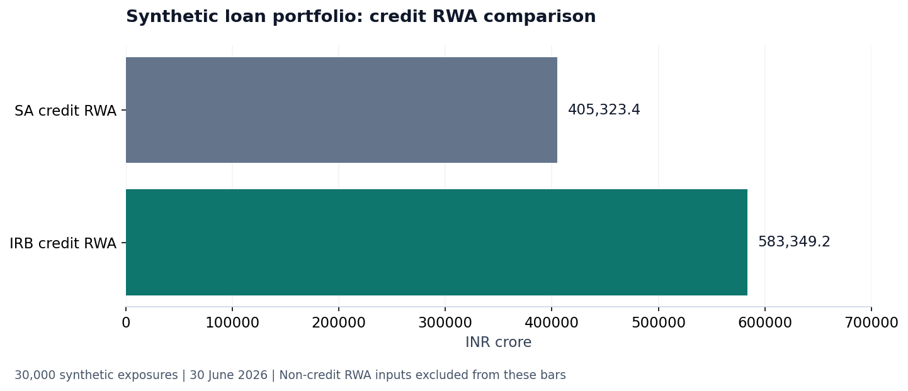

# Basel Credit Capital Engine

## Scope

This educational project demonstrates a complete, reproducible Basel credit-capital calculation using synthetic data.

This project follows 30,000 synthetic bank loans from contractual data to Standardised Approach Credit RWA, IRB Credit RWA, stress results and capital adequacy.

All calculations occur at loan level before aggregation. The Standardised Approach is completed before IRB begins.

## Full-run results

The demonstration run uses 30,000 synthetic exposures, seed 42 and reporting date 30 June 2026. Monetary values are shown in INR crore.

| Metric | Base result |
|---|---:|
| SA EAD before CRM | INR 700,735.5 crore |
| SA Credit RWA | INR 405,323.4 crore |
| IRB Credit RWA | INR 583,349.2 crore |
| Final Total RWA | INR 608,349.2 crore |

The results are synthetic and do not represent a real bank.



## Explore the analysis

[Download the Excel report](outputs/demo/Basel_Credit_Capital_Report.xlsx) · [Calculation map](notebooks/00_complete_calculation_map.ipynb) · [SA–IRB comparison](notebooks/15_sa_irb_comparison_and_output_floor.ipynb) · [Stress and capital headroom](notebooks/18_stress_testing_and_capital_adequacy.ipynb)

IRB credit RWA is higher than SA credit RWA in this configured portfolio. SA uses class-based regulatory weights, while IRB uses the synthetic PD, downturn LGD, EAD and maturity assumptions. IRB is not guaranteed to reduce capital. Compare class-level RWA and the method-specific exposure denominators in notebook 15 before interpreting the difference. The output floor does not bind in the saved base run.

Market RWA of INR 11,000 crore and operational RWA of INR 14,000 crore are configured synthetic inputs; this project calculates the credit component. [Limitations](docs/limitations.md) separates the implemented calculations from assumptions and exclusions.

## Reproducibility

The project uses Python 3.12. Dependencies and test tools are defined in `pyproject.toml`.

```bash
python -m pip install --upgrade pip
python -m pip install -e ".[dev]"
```

| Entry point | Result |
|---|---|
| `python scripts/run_pipeline.py` | Configured full portfolio and calculation tables |
| `python scripts/execute_notebooks.py` | All existing notebooks executed in order, with saved outputs |
| `python -m pytest` | Calculation, regulatory-routing and reconciliation tests |
| `python scripts/audit_notebooks.py` | Saved-execution and explanatory-structure checks |

The notebooks are directly editable. On a fresh checkout, their shared data helper creates missing calculation files from the configuration. After changes to code or assumptions, the pipeline entry point refreshes those files before notebook execution. Local Python environments are machine-specific and are not part of the repository.

## Notebook sequence

| Step | Notebook | Result |
|---:|---|---|
| 0 | [Complete calculation map](notebooks/00_complete_calculation_map.ipynb) | Full project order |
| 1 | [Basel exposure classes](notebooks/01_basel_exposure_classes.ipynb) | Regulatory class reference |
| 2 | [Synthetic bank loan portfolio](notebooks/02_synthetic_bank_loan_portfolio.ipynb) | Necessary-variable loan dataset |
| 3 | [SA loan classification](notebooks/03_sa_loan_classification.ipynb) | Basel class per loan |
| 4 | [SA EAD and CCF](notebooks/04_sa_ead_and_ccf.ipynb) | CCF and EAD per loan |
| 5 | [SA risk weights and mortgage LTV](notebooks/05_sa_risk_weights_and_mortgage_ltv.ipynb) | Applicable risk weight per loan |
| 6 | [SA loan-level RWA and total](notebooks/06_sa_loan_level_rwa_and_total.ipynb) | Total SA Credit RWA |
| 7 | [IRB scope and parameter sources](notebooks/07_irb_scope_and_parameter_sources.ipynb) | IRB eligibility and inputs |
| 8 | [How IRB parameters are estimated](notebooks/08_how_irb_parameters_are_estimated.ipynb) | Real-bank data and estimation route |
| 9 | [Long-run PD and transitions](notebooks/09_irb_long_run_pd_and_transitions.ipynb) | Grade or pool PD per loan |
| 10 | [Downturn LGD](notebooks/10_irb_downturn_lgd.ipynb) | Recovery-based downturn LGD |
| 11 | [IRB EAD and maturity](notebooks/11_irb_ead_and_maturity.ipynb) | IRB EAD and effective maturity |
| 12 | [Correlation, Vasicek and K](notebooks/12_irb_correlation_vasicek_and_k.ipynb) | Conditional PD and capital K |
| 13 | [IRB loan-level RWA and total](notebooks/13_irb_loan_level_rwa_and_total.ipynb) | Total IRB Credit RWA |
| 14 | [Market and operational RWA](notebooks/14_market_and_operational_rwa.ipynb) | INR 25,000 crore non-credit RWA input |
| 15 | [SA, IRB and output floor](notebooks/15_sa_irb_comparison_and_output_floor.ipynb) | Final aggregate RWA |
| 16 | [Stress scenario design](notebooks/16_stress_scenario_design.ipynb) | Synthetic shocks and real calibration route |
| 17 | [Loan-level stress transmission](notebooks/17_stress_loan_level_transmission.ipynb) | Before-and-after risk drivers and RWA |
| 18 | [Stress capital impact](notebooks/18_stress_testing_and_capital_adequacy.ipynb) | Stressed ratios and headroom |
| 19 | [Loan trace and controls](notebooks/19_end_to_end_loan_trace_and_controls.ipynb) | Reconciled calculation trail |

## Calculation structure

### Standardised Approach

1. Basel exposure classification
2. Funded and undrawn exposure
3. Contractual CCF assignment
4. EAD before and after eligible protection
5. Rating, retail or mortgage LTV risk weight
6. Loan-level RWA
7. Total Standardised Approach Credit RWA

### IRB

1. Data and estimation route for PD, LGD, EAD and maturity
2. Long-run one-year PD by borrower grade or retail pool
3. Recovery-based downturn LGD by facility
4. Funded and undrawn IRB EAD
5. Effective maturity with ordinary one-year floor and five-year cap
6. Basel asset correlation
7. 99.9% conditional default probability
8. Unexpected-loss capital K
9. Loan-level `12.5 × K × EAD`
10. Total IRB Credit RWA

### Total RWA and stress

1. Separate synthetic market RWA of INR 11,000 crore and operational RWA of INR 14,000 crore
2. SA and IRB comparison with the aggregate output floor
3. Synthetic scenario design with real-bank calibration context
4. Loan-level PD, LGD, EAD and RWA changes
5. Capital ratio and headroom impact

## Project structure

- `notebooks/`: executed chronological analysis with saved charts and tables.
- `src/basel_credit_risk/`: authoritative loan-level calculations.
- `config/`: Basel reference grids and transparent synthetic assumptions.
- `data/sample/`: small GitHub-safe sample of the synthetic loan file.
- `tests/`: calculation and reconciliation controls.
- [Excel reporting snapshot](outputs/demo/Basel_Credit_Capital_Report.xlsx): verified reporting snapshot built from the saved CSV tables.
- `docs/`: methodology, field definitions, regulatory parameters and limitations.

Generated full loan files remain outside Git tracking. The repository contains code, configuration, executed notebooks, a sample covering every product segment and aggregate reporting output.

## Coverage and limitations

Included: synthetic loan generation, Basel exposure classes, contractual CCFs, loan-level EAD, selected CRM, Standardised Approach risk weights, residential mortgage LTV grids, synthetic long-run PD transitions, recovery-based downturn LGD, foundation and own-estimate IRB parameter routes, IRB EAD and maturity, Basel correlation functions, Vasicek conditional PD, capital K, SA and IRB Credit RWA, transparent market and operational RWA inputs, output floor, stress testing and capital adequacy.

Excluded: real customer data, fitted production rating models, supervisory approval, jurisdiction-specific filing, counterparty credit risk, CVA, securitisation, FRTB, IFRS 9 ECL, ICAAP, liquidity and IRRBB.

## Related projects

[IFRS 9 ECL](https://github.com/keyurmarolia/ifrs9-mortgage-ecl) · [FRTB market risk](https://github.com/keyurmarolia/frtb-market-risk-engine) · [Momentum research](https://github.com/keyurmarolia/momentum-in-indian-equities-research) · [InterGlobe valuation](https://github.com/keyurmarolia/interglobe-aviation-equity-research-model)
